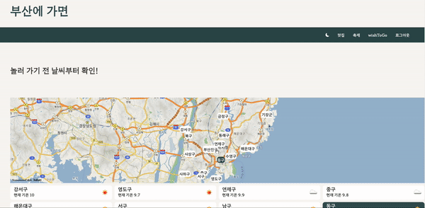
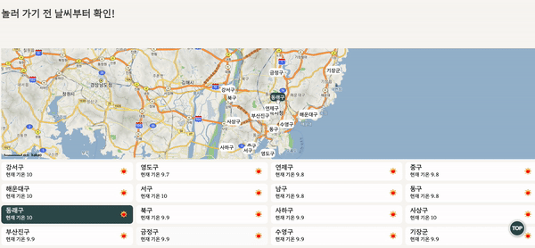
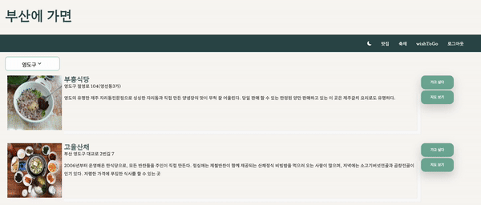
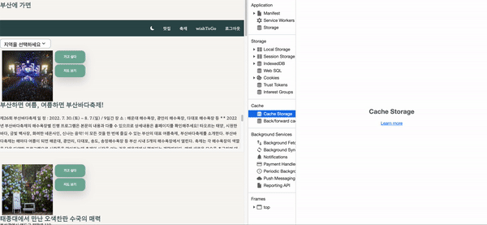
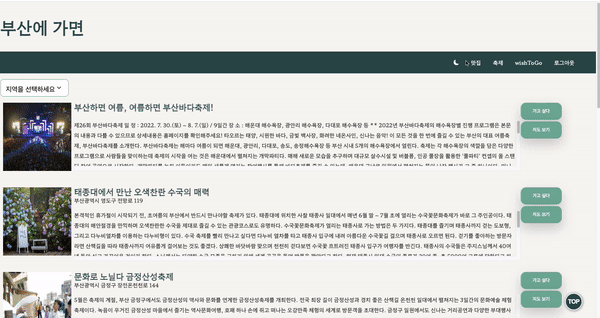
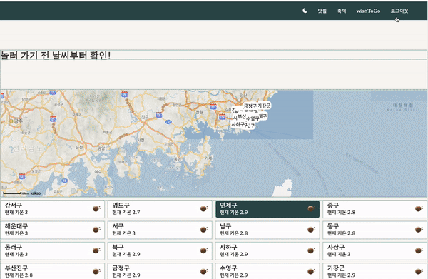
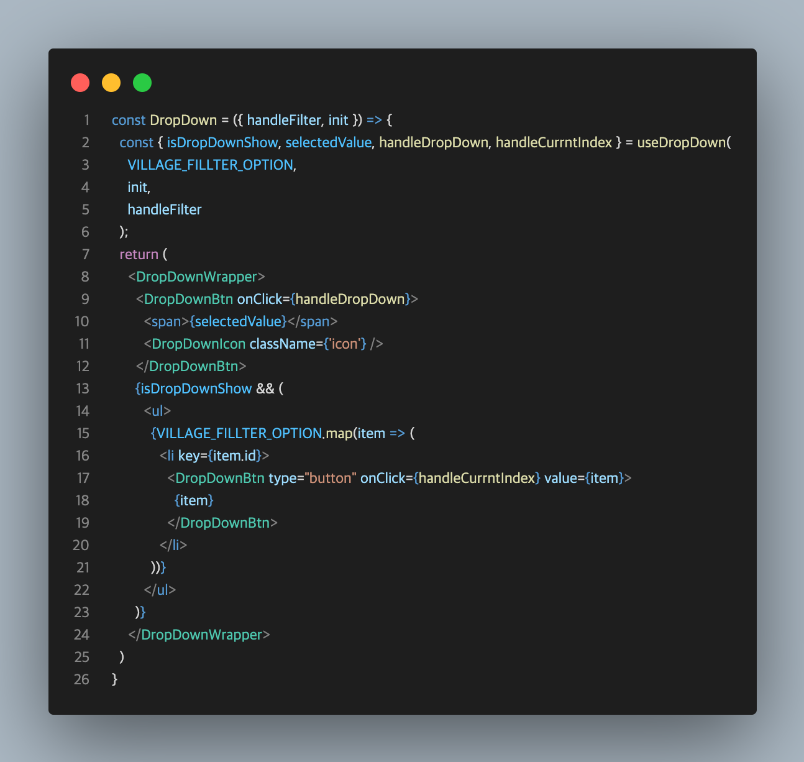

# 부산에 가면
## **✨ 배포 링크**
### [배포링크바로가기](https://pusan-anotheranotherhoon.vercel.app/)

### 로그인 이메일 // 비밀번호

### `test@test.com` // `12341234`

### [회고링크바로가기](https://velog.io/@anotherhoon/%EA%B0%9C%EC%9D%B8-%ED%94%84%EB%A1%9C%EC%A0%9D%ED%8A%B8-%EB%B6%80%EC%82%B0%EC%97%90-%EA%B0%80%EB%A9%B4-%ED%9A%8C%EA%B3%A0)

   
  
   

### 실시간 날짜API와 지도 API 활용

   
  
   

### select, option을 사용하지 않고 DropDown을 직접 만들어 필터 구현

   
  
   

### cacheStorage에  데이터를 캐싱

   
  
   

### Firebase Firestore를 통해 사용자의 wishToGo 리스트 관리

   
  
   

### 반응형 웹 구현

   
  
   

## 📝 목차

- [📰 프로젝트 설명](#-프로젝트-설명)
- [🛠️ Dev Tools](#-dev-tools)
- [🖥 프로젝트 실행 방법](#-프로젝트-실행-방법)

## **📰 프로젝트 설명**

부산의 [맛집](https://www.data.go.kr/iim/api/selectAPIAcountView.do)과 [축제](https://www.data.go.kr/iim/api/selectAPIAcountView.do) 정보와 [지도 정보](https://react-kakao-maps-sdk.jaeseokim.dev/)를 제공하고 저장 할 수 있으며, 부산의 실시간 [날씨](https://openweathermap.org/current)를 확인할 수 있는 웹 어플리케이션입니다.

## **🛠 Dev Tools**

| React | styled-components |  Redux Toolkit   |  React-Query   | Firebase|AXIOS|카카오맵|
| :--------: | :--------: | :------: | :-----: |:------: |:------:|:------:
|   ![reactjs]    |   ![styledcomponents]    | ![redux] | ![reactQuery] |![firebase]|![axios]|![kakaoMap]|

## 구현 기능

### Kakao지도 정보와 실시간 날씨 정보 제공
* 카카오맵에 있는 행정구역과 날씨 정보를 매핑하고 커서를 올릴 경우 지역의 위치 혹은 날씨를 식별할 수있는 이벤트를 바인딩하였습니다.

### cacheStorage사용을 통해 불필요한 데이터 전송을 줄임
* 변하지 않는 맛집, 축제 데이터는 cacheStorage에 저장하여 사용합니다.

### wishToGo 저장 기능
* Firebase의 Firestore Database

### select, option을 사용하지 않고 DropDown을 직접 만들어 필터 구현
* select 태그의 외형은 각 브라우저에서 정의 됩니다. 
* font-size, font, color는 변경이 가능하지만 CSS가 제한적으로 적용됩니다. 따라서 더 좋은 사용자 경험을 위해 DropDown을 직접 만들어 필터를 구현하였습니다.
* [useDropDown](https://github.com/anotheranotherhoon/pusan/blob/main/src/hook/useDropDown.js) 훅으로 드롭다운 기능을 구현하였습니다.

   
  
   

### 반응형 웹 구현
* 미디어쿼리를 이용하여 필요에 따라 [html 구조](https://github.com/anotheranotherhoon/pusan/blob/94cc4c573a6d125dee50882a0172385b3ae8d139/src/components/Card.js#L18-L46)를 변경하여 반응형 웹을 구현하였습니다.

### 다크 모드
* Redux Toolkit 상태관리 라이브러리를 통한 다크 모드
* Redux-Persist를 이용하여 localStorage에 theme의 값 관리

### scroll To Top
* 일정 높이 이상 스크롤이 내려갈 경우에 좌측 하단에 TOP 버튼이 생기고 클릭시 최상단으로 smooth하게 올라가게됨

### 로그인, 회원가입 기능
* firebase를 사용하여 로그인 및 회원가입 기능 구현

##  **🌱 commit message 규칙**

커밋 규칙

⭐ feat : 새로운 기능에 대한 커밋

🎨 ui : 새로운 CSS관련 디자인에 대한 커밋

🛠 fix : 버그 수정에 대한 커밋

🧱 build : 빌드 관련 파일 수정에 대한 커밋

👏 chore : 파일 이동, 파일명 수정, 변수 제거 등의 자잘한 수정에 대한 커밋

⚒ refactor : 코드 리팩토링에 대한 커밋

📝 style : 공백 제거와 같은, 코드 스타일 혹은 포맷 등에 관한 커밋

✏ docs : 문서 수정에 대한 커밋

💡 ci : CI관련 설정 수정에 대한 커밋

## 📚 사용 Library

Lib List

### production
- react
- react-query
- firebase
- redux-toolkit
- redux-thunk
- redux-persist
- styled-components
- axios
-  react-kakao-maps-sdk
- react-loader-spinner

<!-- Stack Icon Refernces -->

[reactjs]: /images/stack/reactjs.png
[styledcomponents]: /images/stack/styledcomponents.png
[redux]: /images/stack/redux.png
[reactrouter]: /images/stack/reactrouter.png
[firebase]: /images/stack/firebase.png
[axios]:/images/stack/axios.png
[reactQuery]:/images/stack/reactQuery.svg
[kakaoMap]:/images/stack/kakaoMap.png
