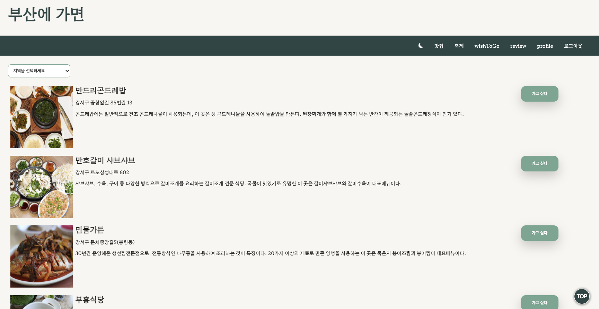

# 부산에 가면

* [배포링크](https://pusan.vercel.app/)
* [서버Github](https://github.com/anotheranotherhoon/openAPIserver)

   
  
   

## 프로젝트 소개

부산을 대표하는 축제와 식당들을 소개합니다.

 

## 기술 스택

| React | styled-components |  Redux Toolkit   |  React-Router   | Firebase|AXIOS|
| :--------: | :--------: | :------: | :-----: |:------: |:------:
|   ![reactjs]    |   ![styledcomponents]    | ![redux] | ![reactrouter] |![firebase]|![axios]|

 

## 구현 기능

### 기능 1
Redux Toolkit 상태관리 라이브러리를 통한 다크 모드
* localStorage 에 theme의 값( dark 또는 light)
### 기능 2
scroll To Top

* 일정 길이 이상 스크롤이 내려갈 경우 TOP 버튼이 생기고 클릭시 최상단으로 올라가게됨

### 기능 3
firebase를 통한 회원가입

### 기능 4
회원에 따른 wishToGo리스트
* wishToGo리스트를 개별적으로 관리한다.
 

## 배운 점 
공공API 사용시 CORS 에러발생에대한 해결 방법

1. 

## 아쉬운 점

1. 

 

<!-- Stack Icon Refernces -->

[reactjs]: /images/stack/reactjs.png
[styledcomponents]: /images/stack/styledcomponents.png
[redux]: /images/stack/redux.png
[reactrouter]: /images/stack/reactrouter.png
[firebase]: /images/stack/firebase.png
[axios]:/images/stack/axios.png